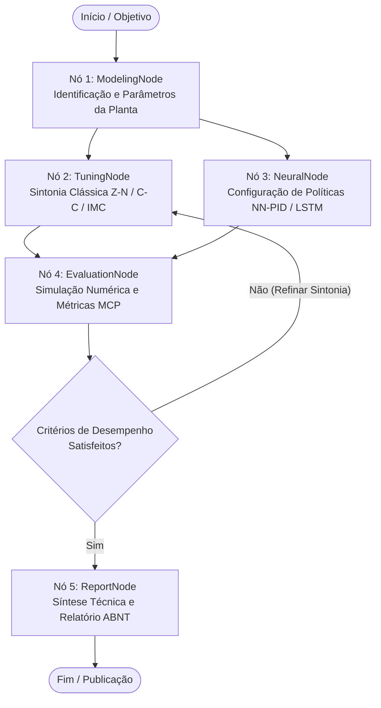

# Diretrizes de Operação e Governança de Agentes Autônomos (AGENTS.md)
## Projeto: PID Neural Control — PROIC / UESC

Este documento estabelece as diretrizes arquiteturais, restrições operacionais e padrões de governança para agentes inteligentes atuando no projeto **PID Neural Control (Iniciação Científica — UESC)**.

---

## 1. Contexto do Domínio de Engenharia

O projeto investiga o controle térmico avançado aplicado a plantas químicas contínuas com forte dinâmica não-linear e cinética exotérmica, tomando como caso de estudo representativo o **Reator Contínuo de Mistura Perfeita (CSTR - Continuous Stirred-Tank Reactor)** encamisado com reação irreversível de primeira ordem $A \to B$.

### 1.1 Modelo Fenomenológico (EDOs Não-Lineares Acopladas)
A planta é modelada pelo sistema de equações diferenciais ordinárias fundamentado em conservação de massa e entalpia:

1. **Balanço de Massa do Reagente $A$:**
   $$\frac{dC_A(t)}{dt} = \frac{q}{V} \left(C_{Af} - C_A(t)\right) - k_0 \exp\left(-\frac{E}{R T(t)}\right) C_A(t)$$

2. **Balanço de Energia do Reator:**
   $$\frac{dT(t)}{dt} = \frac{q}{V}\left(T_f - T(t)\right) + \frac{(-\Delta H)}{\rho C_p} k_0 \exp\left(-\frac{E}{R T(t)}\right) C_A(t) - \frac{UA}{V \rho C_p}\left(T(t) - T_j(t)\right)$$

3. **Balanço de Energia da Camisa de Resfriamento:**
   $$\frac{dT_j(t)}{dt} = \frac{q_j(t)}{V_j}\left(T_{jf} - T_j(t)\right) + \frac{UA}{V_j \rho_j C_{pj}}\left(T(t) - T_j(t)\right)$$

Onde a vazão de refrigeração da camisa $q_j(t)$ atua como a variável manipulada $u(t)$ sujeita a limites físicos de amplitude $[u_{\min}, u_{\max}]$ e taxa de variação (slew-rate $\lvert \Delta u / \Delta t \rvert \le S_{\max}$). Devido à lei de Arrhenius $k(T) = k_0 \exp(-E/RT)$, a planta exibe multiplicidade de estados estacionários e instabilidade local de malha aberta no ponto de alta conversão ($\lambda_1 > 0$), tornando o controle de temperatura crítico para a prevenção de *thermal runaway*.

### 1.2 Escopo Comparativo de Controle
O sistema multi-agente compara formalmente:
- **Estratégias Clássicas:** PID digital com anti-windup (clamping / back-calculation), filtragem da derivada e sintonia por modelos FOPTD aproximados ($\tau_d, \tau, K$) via Ziegler-Nichols, Cohen-Coon e Internal Model Control (IMC / Skogestad SIMC).
- **Estratégias Neurais & Inteligentes:** Redes Neurais Adaptativas (NN-PID com auto-ajuste de ganhos online), modelos recorrentes LSTM e PINNs (*Physics-Informed Neural Networks*) para compensação de não-linearidades e perturbações de carga.

---

## 2. Regra de Ouro (Golden Rule)

> [!CAUTION]
> **REGRA DE OURO PARA TODOS OS AGENTES LLM:**
> **O LLM NUNCA deve integrar numericamente EDOs, resolver balanços de energia ou calcular índices de desempenho de controle via aproximação textual ou raciocínio gerativo.**
> Qualquer simulação temporal, cálculo de integrais de erro (IAE, ISE, ITAE), sobressinal ($M_p$), tempos de resposta ($t_r, t_s$), variação total ($TV$) ou síntese analítica de parâmetros de controladores **DEVE OBRIGATORIAMENTE** ser delegada a ferramentas determinísticas em Python (via funções de biblioteca especializadas ou servidores de ferramentas MCP).

O papel dos modelos de linguagem é **orquestração, raciocínio de alto nível, formulação de hipóteses, interpretação comparativa de resultados e síntese textual**, mantendo a física e o cálculo numérico estritamente sob módulos determinísticos validados.

---

## 3. Arquitetura Multi-Agentes (LangGraph)

O fluxo de decisão e análise é orquestrado como um grafo de estados cíclico/condicional utilizando **LangGraph**:



### 3.1 Responsabilidades dos Nós
1. **ModelingNode:**
   - Carrega e valida os parâmetros do sistema físico (volume, capacidades térmicas, cinética e perturbações).
   - Extrai ou lineariza a função de transferência equivalente FOPTD ($K, \tau, \theta$).
2. **TuningNode:**
   - Solicita à ferramenta `tune_classical_pid` o cálculo analítico dos ganhos ($K_p, T_i, T_d$) sob métodos clássicos (Z-N, Cohen-Coon, IMC) e especificação de robustez (ex.: parâmetro de filtro $\lambda_c$).
3. **NeuralNode:**
   - Define a arquitetura neural (hiperparâmetros, camadas ocultas, taxa de aprendizado) para os esquemas NN-PID ou LSTM.
4. **EvaluationNode:**
   - Aciona `simulate_thermal_plant` para executar a integração numérica das EDOs em malha fechada via `scipy.integrate.solve_ivp`.
   - Aciona `compute_transient_metrics` para obter formalmente $t_r, t_s, M_p$, IAE, ISE, ITAE e $TV$.
   - Compara objetivamente os controladores através de análise de Pareto ($IAE \times TV$).
5. **ReportNode:**
   - Gera relatórios técnicos em Markdown e compila seções prontas para LaTeX no padrão ABNT/IEEE (com tabelas `booktabs` e `siunitx`).

---

## 4. Servidor MCP de Controle (Model Context Protocol)

O agente acessa as capacidades de simulação através do servidor FastMCP (`src/mcp/control_mcp.py`):

| Ferramenta MCP | Descrição | Entradas Principais | Saída |
|---|---|---|---|
| `simulate_thermal_plant` | Integração de EDOs via `solve_ivp` (RK45/Radau) em malha fechada | `system_id`, `setpoint`, `duration_s`, `dt_s` | Séries temporais de $t, y(t), u(t)$ |
| `compute_transient_metrics` | Cálculo numérico rigoroso de métricas transitórias e esforço | `time_series`, `output_series`, `setpoint`, `control_series` | Dicionário com $t_r, t_s, M_p$, IAE, ISE, ITAE, TV |
| `tune_classical_pid` | Cálculo analítico de ganhos com checagem de singularidades | $k, \tau, \theta$, método (`"imc"`, `"ziegler_nichols"`, `"cohen_coon"`) | Dicionário com $K_p, T_i, T_d$ |

---

## 5. Observabilidade e Telemetria (Langfuse)

Todas as execuções do grafo multi-agente devem ser transparentes, auditáveis e rastreáveis.
- **Rastreamento de Execução:** Instrumentado via `langfuse.callback.CallbackHandler` injetado na configuração do grafo:
  ```python
  from langfuse.callback import CallbackHandler
  langfuse_handler = CallbackHandler()
  result = graph.invoke(state, config={"callbacks": [langfuse_handler]})
  ```
- **Métricas Observadas:** Latência por nó, contagem de tokens de entrada/saída, custos de inferência, tool calls MCP executadas e anotações de avaliação das métricas de controle ($IAE$, $M_p$).

---

## 6. Comandos Canônicos de Engenharia e Qualidade

Todos os agentes e desenvolvedores devem certificar suas implementações utilizando os seguintes comandos:

```bash
# Executar suíte completa de testes com cobertura
pytest -v

# Executar testes específicos do servidor MCP de controle
pytest tests/test_control_mcp.py -v

# Checagem de linting e padrões de código (Ruff)
ruff check .

# Formatação de código
black --check .
```

---

## 7. Governança e Orquestração Autônoma de Skills

O assistente e os nós operacionais do sistema empregam uma camada autônoma de roteamento de skills (`src/agents/skill_orchestrator.py` e `.agents/rules/skill_orchestrator.md`) regida por:
1. **Progressive Disclosure**: Nenhuma skill é carregada indiscriminadamente. O orquestrador avalia o escopo e aciona apenas os runbooks requeridos para a tarefa corrente.
2. **Taxonomia em Tiers**:
   - **Tier 1 (Core)**: `process-control-systems`, `python-pro`, `ml-best-practices`, `academic-paper-latex`, `llm-application-dev-langchain-agent`, `literature-search-*`.
   - **Tier 2 (Suporte)**: `notebook-guidance`, `generative_ui`, `operations-research-supply-chain`.
   - **Tier 3 (Bloqueadas)**: Skills de bioinformática, cloud genérico e mobile são estritamente isoladas para proteger a fidelidade matemática do projeto.
3. **Determinismo Físico e Numérico**: Todas as invocações de skills devem manter estrita adesão à Regra de Ouro (Seção 2).
