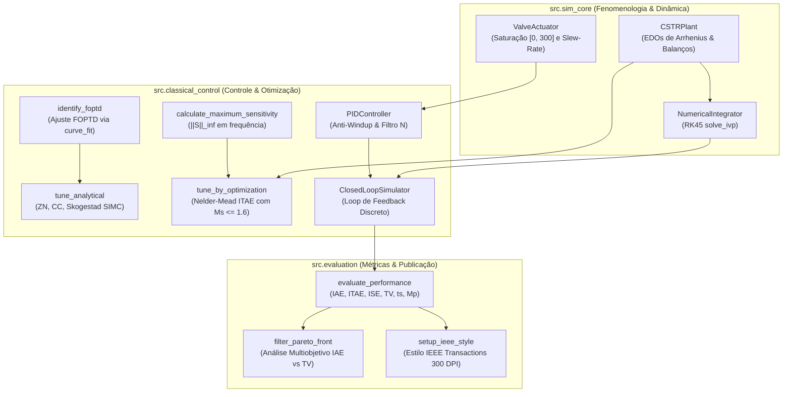

# Arquitetura do Pacote `src` — Simulação e Controle de Processos

> **Documentação de Engenharia de Software e Modelagem Computacional**  
> Pacote modular de alta precisão para simulação não-linear do reator CSTR, controle clássico PID, otimização com restrição de robustez em frequência e avaliação de desempenho multi-objetivo.

---

## Visão Geral da Arquitetura

O pacote `src/` foi projetado segundo os princípios de **Baixo Acoplamento e Alta Coesão**, separando estritamente a física fenomenológica do processo químico (`sim_core`), os algoritmos de controle e sintonia (`classical_control`) e as ferramentas de avaliação de desempenho e visualização científica (`evaluation`).



---

## 1. Módulo `src.sim_core` — Fenomenologia e Física da Planta

Este módulo encapsula as equações diferenciais ordinárias (EDOs) do reator, os limites físicos reais dos atuadores mecânicos e a integração numérica temporal de alta precisão.

### 1.1 `cstr_plant.py` — Planta Física e Cinética Não-Linear
* **`CSTRParameters` (Dataclass imutável):**  
  Armazena todas as constantes termodinâmicas e operacionais nominais ($q = 100\text{ L/min}$, $V = 100\text{ L}$, $k_0 = 7.2 \times 10^{10}\text{ min}^{-1}$, $E/R = 8750\text{ K}$, $\Delta H = -5.0 \times 10^4\text{ cal/mol}$, $\rho c_p = 500\text{ cal/(L}\cdot\text{K)}$, $UA = 5.0 \times 10^4\text{ cal/(min}\cdot\text{K)}$, $V_j = 20\text{ L}$).
* **`CSTRState` (Dataclass):**  
  Representa o vetor de estados instantâneo do sistema:  
  $$x = \begin{bmatrix} C_A & T & T_j \end{bmatrix}^T$$
* **`CSTRPlant`:**
  * `reaction_rate(C_A, T)`: Calcula $r_A = k(T) \cdot C_A$ com trava de segurança para temperaturas fisicamente consistentes ($T \ge 100\text{ K}$).
  * `derivatives(t, state, q_j, disturbances)`: Avalia o campo de vetores $\dot{x} = f(x, u, d)$ permitindo a injeção em tempo real de distúrbios em $T_f$, $C_{Af}$, $UA$, $T_{jf}$ e $q$.
  * `find_steady_state(q_j, initial_guess)`: Encontra o ponto de equilíbrio de regime permanente $x_{ss}$ tal que $f(x_{ss}, q_j) = 0$ via solver híbrido de Powell (`scipy.optimize.root`).
  * `linearize(state_ss, q_j_ss)`: Computa a Jacobiana analítica contínua exata:
    $$A = \left.\frac{\partial f}{\partial x}\right|_{x_{ss}, u_{ss}}, \quad B = \left.\frac{\partial f}{\partial u}\right|_{x_{ss}, u_{ss}}$$
    onde:
    $$A = \begin{bmatrix}
    -\frac{q}{V} - k & -C_A \frac{dk}{dT} & 0 \\
    \frac{-\Delta H}{\rho c_p} k & -\frac{q}{V} + \frac{-\Delta H}{\rho c_p} C_A \frac{dk}{dT} - \frac{UA}{V \rho c_p} & \frac{UA}{V \rho c_p} \\
    0 & \frac{UA}{V_j \rho_j c_{pj}} & -\frac{q_j}{V_j} - \frac{UA}{V_j \rho_j c_{pj}}
    \end{bmatrix}, \quad
    B = \begin{bmatrix} 0 \\ 0 \\ \frac{T_{jf} - T_j}{V_j} \end{bmatrix}$$
    com $\frac{dk}{dT} = k(T) \frac{E/R}{T^2}$.

### 1.2 `actuators.py` — Dinâmica e Saturação da Válvula
* **`ActuatorLimits`:** Define o envelope físico da válvula de resfriamento:
  * $u_{\min} = 0.0\text{ L/min}$ (válvula totalmente fechada).
  * $u_{\max} = 300.0\text{ L/min}$ (capacidade máxima de bombeamento).
  * $\text{max\_slew\_rate} = 80.0\text{ ou }100.0\text{ L/min}^2$ (velocidade máxima de deslocamento da haste).
* **`ValveActuator`:**  
  Executa a imposição de limites físicos e taxa de variação finita a cada intervalo de amostragem $\Delta t$:
  $$\Delta u_{\max} = \text{max\_slew\_rate} \cdot \Delta t$$
  Retorna o valor efetivamente aplicado à planta e uma flag booleana `is_saturated` essencial para os algoritmos de *anti-windup*.

### 1.3 `integrator.py` — Soluções Numéricas de EDOs
* **`NumericalIntegrator`:**  
  Utiliza o algoritmo implícito de Dormand-Prince de passo adaptativo (`RK45` via `scipy.integrate.solve_ivp`) com tolerâncias estritas ($rtol = 10^{-6}$, $atol = 10^{-8}$).
  * `step(plant, current_state, q_j, t_current, dt, disturbances)`: Integra de forma rigorosa as trajetórias do reator entre dois instantes discretos de controle $t_k$ e $t_k + \Delta t$.
  * `simulate_open_loop(plant, initial_state, t_span, dt, u_func)`: Realiza simulações em malha aberta para ensaios degrau e verificação de não-linearidades.

---

## 2. Módulo `src.classical_control` — Controle e Otimização

Implementa controladores industriais em tempo discreto, identificação paramétrica empírica e rotinas de otimização de sintonia com garantia de estabilidade no domínio da frequência.

### 2.1 `foptd.py` — Identificação FOPTD
* **`FOPTDModel`:**  
  Encapsula o modelo de função de transferência aproximado:
  $$G(s) = \frac{K_p e^{-\theta s}}{\tau s + 1}$$
* **`identify_foptd(t, y, delta_u, y0)`:**  
  Ajusta a resposta ao degrau temporal aos parâmetros $(K_p, \tau, \theta)$ utilizando mínimos quadrados não-lineares (`scipy.optimize.curve_fit`).  
  Implementa uma estimativa inicial heurística robusta via tempos característicos de $28.3\%$ e $63.2\%$ da resposta total, garantindo rápida convergência global e resíduo RMS mínimo.

### 2.2 `pid_controller.py` — PID Digital de Padrão Industrial
Implementa a formulação paralela do controlador PID em tempo discreto com as melhores práticas de automação industrial:

$$u(t) = u_{\text{bias}} + P(t) + I(t) + D(t)$$

1. **Ação Proporcional:** $P(t_k) = K_p \cdot e(t_k)$.
2. **Ação Derivativa Filtrada sobre a Medição (Derivative on Measurement):**
   Para eliminar o fenômeno de choque derivativo (*derivative kick*) durante variações bruscas de setpoint, a derivada atua sobre $-y(t_k)$:
   $$D(s) = -K_p \frac{T_d \cdot s}{\frac{T_d}{N} s + 1} Y(s)$$
   com coeficiente de filtro $N = 10$ e discretização por aproximação exponencial de primeira ordem.
3. **Ação Integral com Anti-Windup Duplo:**
   * **Conditional Clamping:** Congela a integração trapezoidal sempre que o atuador satura e o erro persiste na direção que aprofundaria a saturação:
     $$\text{Se } u_{\text{unconstrained}} \ge u_{\max} \text{ e } e > 0 \implies \frac{dI}{dt} = 0$$
   * **Back-Calculation:** Mecanismo de rastreamento com constante $T_t = \sqrt{T_i T_d}$:
     $$I(t_k) = I(t_{k-1}) + \frac{K_p \Delta t}{T_i} e(t_k) + \frac{\Delta t}{T_t}(u_{\text{applied}} - u_{\text{unconstrained}})$$

### 2.3 `tuning_analytical.py` — Sintonias Analíticas FOPTD
Executa o cálculo automático dos ganhos $(K_p, T_i, T_d)$ para processos de ação direta ou reversa ($\text{sgn}(K_p)$):
* **`ZIEGLER_NICHOLS_PID`:** Curva de reação tradicional em malha aberta.
* **`COHEN_COON_PID`:** Ajuste com compensação refinada da fração de tempo morto $\theta / \tau$.
* **`SKOGESTAD_SIMC_PID` / `SKOGESTAD_SIMC_PI`:** Sintonia por controle por modelo interno simplificado. O usuário pode calibrar o tempo de malha fechada desejado $\tau_c$.

### 2.4 `tuning_optimization.py` — Otimização Numérica com Restrição de Robustez
* **`calculate_maximum_sensitivity(plant, nominal_state, q_j_ss, gains)`:**  
  A partir da linearização contínua $(A, B, C)$, computa a resposta em frequência de malha aberta $L(j\omega) = G(j\omega) C(j\omega)$ em uma grade de $300$ frequências logarítmicas de $\omega = 10^{-3}$ a $10^2\text{ rad/min}$. Em seguida, avalia o pico de sensibilidade máxima:
  $$M_s = \max_\omega |S(j\omega)| = \max_\omega \left| \frac{1}{1 + L(j\omega)} \right|$$
* **`tune_by_optimization(...)`:**  
  Utiliza o algoritmo de busca direta simplex de Nelder-Mead (`scipy.optimize.minimize`) para otimizar os ganhos $(K_p, T_i, T_d)$ simulando a malha não-linear completa e impondo uma penalidade exterior de barreira quadrática quando $M_s > 1.6$:
  $$J = \text{ITAE} + 10^4 \cdot \max(0, M_s - 1.6)^2 + 10^3 \cdot \text{Offset}$$

### 2.5 `closed_loop.py` — Motor de Simulação em Malha Fechada
* **`ClosedLoopSimulator`:**  
  Coordena o avanço temporal discreto conectando `Plant`, `PIDController` e `Actuator`. Suporta perfis dinâmicos de setpoint $r(t)$, perturbações não medidas nos parâmetros termodinâmicos $d(t)$ e ruído de medição gaussiano $\mathcal{N}(0, \sigma^2)$ com semente reproduzível.
* **`ClosedLoopResult`:**  
  Estrutura rica contendo os vetores temporais $t$, $r(t)$, $y(t)$, $u(t)$, os estados completos do reator $[C_A, T, T_j]$ e a estrutura de métricas calculadas.

---

## 3. Módulo `src.evaluation` — Métricas e Estilização Visual

### 3.1 `metrics.py` — Métricas Rigorosas de Controle
Computa via quadratura numérica trapezoidal:
* $\text{IAE}$, $\text{ITAE}$, $\text{ISE}$
* $\text{TV} = \sum |u_k - u_{k-1}|$ (esforço e desgaste do atuador)
* Sobressinal percentual $M_p$
* Tempo de acomodação $t_s$ (critério estrito de $\pm 2\%$)
* Tempo de subida $t_r$ (faixa de $10\%$ a $90\%$)

### 3.2 `pareto.py` — Análise de Fronteira de Pareto
* **`ParetoPoint` & `ParetoFrontierSummary`:**  
  Estruturas de dados imutáveis contendo pares $(\text{IAE}, \text{TV})$, sensibilidade $M_s$ e metadados.
* **`filter_pareto_front(points, ms_threshold=1.6)`:**  
  Extrai os pontos não dominados (onde nenhum outro ponto apresenta menor IAE E menor TV simultaneamente), filtrando preliminarmente soluções instáveis que violam a restrição de sensibilidade máxima $M_s > 1.6$.
* **`find_knee_point(pareto_front)`:**  
  Detecta o "ponto de joelho" (melhor compromisso prático de engenharia) através da distância euclidiana mínima normalizada em relação ao ponto utópico $(0, 0)$.

### 3.3 `plot_styles.py` — Configuração de Gráficos Padrão IEEE
* Configura globalmente o `matplotlib.rcParams` para conformidade estrita com os critérios editoriais do **IEEE Transactions**:
  * Larguras padronizadas: coluna simples ($3.50\text{ in}$) e coluna dupla ($7.16\text{ in}$).
  * Tipografia vetorial Times New Roman / Computer Modern com incorporação TrueType (Type 42).
  * Paleta de cores *Colorblind-Safe* de alto contraste (`IEEE_PALETTE`).
  * Estilos de linha e marcadores distintos para assegurar legibilidade em impressões preto e branco.

---

## Como Utilizar o Pacote via Código ou Spyder 6

### Exemplo Rápido: Simulação Nominal em Malha Fechada

```python
# %% Importação dos Módulos Principais
from src.sim_core.cstr_plant import CSTRPlant
from src.classical_control.foptd import identify_foptd
from src.classical_control.tuning_analytical import TuningRule, tune_analytical
from src.classical_control.pid_controller import PIDController, AntiWindupMethod
from src.classical_control.closed_loop import ClosedLoopSimulator
from src.sim_core.actuators import ActuatorLimits

# %% Inicialização da Planta e Ponto de Equilíbrio
plant = CSTRPlant()
q_j_ss = 100.0  # L/min
ss = plant.find_steady_state(q_j=q_j_ss)
print(f"Ponto nominal: T = {ss.T:.2f} K, C_A = {ss.C_A:.4f} mol/L")

# %% Sintonia Analítica Skogestad SIMC
from src.classical_control.foptd import FOPTDModel
model = FOPTDModel(k_p=-0.135, tau=0.380, theta=0.095)
gains_simc = tune_analytical(model, rule=TuningRule.SKOGESTAD_SIMC_PID, tau_c=0.40)

# %% Configuração do Controlador e Simulação
limits = ActuatorLimits(u_min=0.0, u_max=300.0, max_slew_rate=100.0)
controller = PIDController(
    gains=gains_simc,
    actuator_limits=limits,
    anti_windup=AntiWindupMethod.CLAMPING,
    u_bias=q_j_ss
)

sim = ClosedLoopSimulator()
result = sim.run(
    plant=plant,
    controller=controller,
    initial_state=ss,
    t_span=(0.0, 10.0),
    dt=0.02,
    setpoint_func=lambda t: ss.T - 2.0  # Degrau de -2 K
)

print(f"Desempenho SIMC: IAE = {result.metrics.iae:.2f}, TV = {result.metrics.tv:.1f} L/min")
```

### Depuração Interativa no Spyder 6
1. Abra o arquivo desejado no editor do Spyder 6.
2. Observe que as seções acima são delimitadas por `# %%`.
3. Pressione **`Shift + Enter`** para executar a célula e inspecionar os objetos `result.states`, `result.metrics` no **Variable Explorer**.
